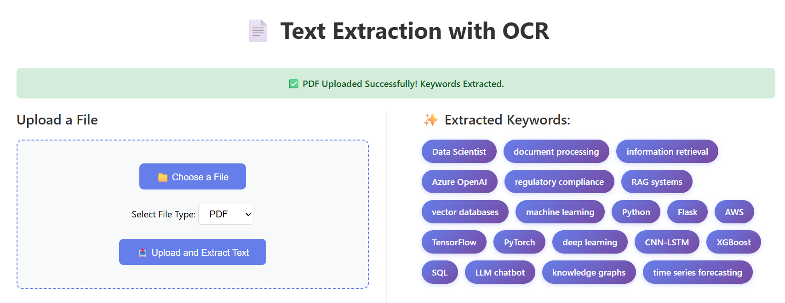

# 📄 Text & Keyword Extractor from Images and PDFs

A powerful web application that extracts text from images and PDF files, then automatically identifies and highlights the most important keywords using advanced NLP techniques.




---

## 🎯 Features

✨ **Multi-Format Support**
- Extract text from PDF documents
- Extract text from images using OCR (PNG, JPG, JPEG, GIF)

🔍 **Advanced Keyword Extraction**
- YAKE algorithm for unsupervised keyword extraction
- spaCy for noun phrase extraction
- Frequency-based keyword identification

🎨 **User-Friendly Web Interface**
- Clean, intuitive Flask-based web application
- Real-time text and keyword display
- Error handling with user feedback

⚡ **Fast Processing**
- Optimized for quick extraction
- Handles large documents efficiently
- Automatic text preprocessing

---

## 📋 Sample Output

### Extracted Keywords:


</div>

---

## 🚀 Quick Start

### Prerequisites
- Python 3.8 or higher
- pip (Python package manager)
- Tesseract OCR (for image text extraction)

### Installation

1. **Clone the repository**
```bash
git clone https://github.com/yourusername/Text-keyword_extractor-from-Image-and-PDF.git
cd Text-keyword_extractor-from-Image-and-PDF
```

2. **Create and activate virtual environment**
```bash
# On Windows
python -m venv myenv
myenv\Scripts\activate

# On macOS/Linux
python3 -m venv myenv
source myenv/bin/activate
```

3. **Install dependencies**
```bash
pip install -r requirements.txt
python -m spacy download en_core_web_sm
```

4. **Install Tesseract OCR**
- **Windows**: Download from [GitHub Tesseract](https://github.com/UB-Mannheim/tesseract/wiki)
- **macOS**: `brew install tesseract`
- **Linux**: `sudo apt-get install tesseract-ocr`

5. **Run the application**
```bash
python app.py
```

6. **Open in browser**
```
http://localhost:5000
```

---

## 🔧 Usage

### Web Interface
1. Open the web app at `http://localhost:5000`
2. Click **"Choose a File"** to select an image or PDF
3. Select the file type (Image or PDF)
4. Click **"Upload and Extract Text"**
5. View extracted text and keywords

### Python API

```python
from pdf_extractor import extract_text_from_pdf
from ocr_engine import OCREngine
from keyword_extract import extract_keywords

# Extract from PDF
text = extract_text_from_pdf('document.pdf')

# Extract from Image
ocr = OCREngine()
text = ocr.extract_text('image.jpg')

# Extract Keywords
keywords = extract_keywords(text)
print(keywords)
```

---

## 🎛️ Keyword Extraction Methods

The project includes **3 different extraction methods**:

### 1. **YAKE** (Recommended) ⭐
- Best for general documents
- Unsupervised learning
- No training required

### 2. **spaCy Noun Chunks**
- Extracts important noun phrases
- Great for CVs and resumes
- Identifies key entities

### 3. **Frequency-Based**
- Finds most common terms
- Simple but effective
- Filters out stop words

---

## 📄 License

This project is licensed under the MIT License - see the LICENSE file for details.

---

## 👨‍💻 Author

**Parth Patel**
- 📧 Email: Parth.Patel@my.utsa.edu
- 🔗 LinkedIn: [PatelParth24](https://linkedin.com)
- 💻 GitHub: [patelandpatel](https://github.com/patelandpatel)

---
## 📚 Resources

- [PyMuPDF Documentation](https://pymupdf.io/)
- [spaCy Documentation](https://spacy.io/)
- [YAKE Documentation](https://github.com/LIAAD/yake)
- [Flask Documentation](https://flask.palletsprojects.com/)

---

**⭐ If you found this useful, please star the repository!**
